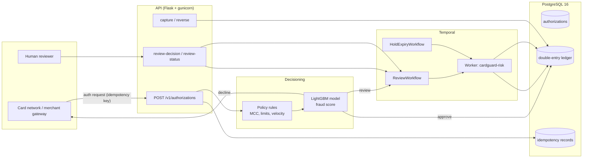
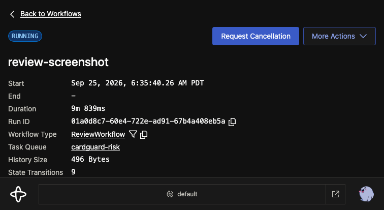

# cardguard

Cardguard is a real-time card authorization risk engine modeled on corporate card
spend management. Companies issue cards to employees, every authorization is scored
against spend policies and a fraud model, and every approved dollar is recorded in a
double-entry ledger so that holds, captures, reversals, and expiries always balance to
zero. Decisions that need a human (or that should age out) run as durable Temporal
workflows rather than in the HTTP request path, so a crashed worker, a restarted API,
or a lost signal can never lose money or double-post it. The whole system is built to
be provably correct under retries: idempotency keys on the way in, unique constraints
in the database, and property tests that hammer the ledger with random operation
sequences to prove the invariants hold.

## Architecture



## Quickstart

```sh
make up        # postgres 16, temporal, temporal-ui, worker, api (docker compose)
make migrate   # alembic upgrade head
make seed      # 3 companies, 25 employees, 25 cards, spend policies
make test      # pytest with coverage (also runs the Temporal integration suite)
```

Optional:

```sh
make data      # generate the synthetic transaction dataset
make train     # train the LightGBM model, write metrics + model card
make loadtest  # k6 scenarios A/B (requires the stack up; k6 on PATH)
make demo      # end-to-end lifecycle demo
make demo-crash  # crash-durability demo (kills the worker mid-workflow)
```

## API reference

| Endpoint | Method | Purpose |
|---|---|---|
| `/v1/authorizations` | POST | Authorization + risk decision. Body: `idempotency_key`, `card_token`, `merchant_name`, `mcc`, `amount_cents`, `timestamp`. Returns `authorization_id` (uuid), `decision` (`approve`\|`decline`\|`review`), `decision_reason`, `risk_score`, `latency_ms`. Replays return the stored response verbatim with header `Idempotent-Replay: true`; the same key with a different body is a `409`. |
| `/v1/authorizations/<id>/capture` | POST | Capture the hold (`amount_cents <= held`); partial capture releases the remainder. Over-capture is a `409`. |
| `/v1/authorizations/<id>/reverse` | POST | Reverse captured and held amounts back to available credit. |
| `/v1/authorizations/<id>/review-decision` | POST | Signal the running `ReviewWorkflow`: `{"decision": "approve"\|"decline", "reviewer_id", "note"}`. |
| `/v1/authorizations/<id>/review-status` | GET | Query the workflow state: `pending_review`, `approved`, `declined`, or `auto_declined`. |
| `/v1/accounts/<id>/balance` | GET | Derived account balance computed from ledger entries. |
| `/healthz`, `/readyz` | GET | Liveness / readiness (readiness checks the database). |

Decision reasons: `APPROVED`, `MCC_BLOCKED`, `PER_TXN_LIMIT`, `MONTHLY_LIMIT`,
`VELOCITY`, `NEAR_MONTHLY_LIMIT`, `MODEL_HIGH_RISK`, `MODEL_REVIEW`,
`REVIEW_TIMEOUT`, `REVIEW_DECLINED`, `EXPIRED`.

## Measured performance

Measured with k6 against the local stack (gunicorn 4 workers x 8 threads, PostgreSQL 16,
LightGBM scoring in-process) on a shared Apple Silicon dev machine (8 cores, noisy
neighbors — treat the tails as upper bounds, not steady-state behavior). Raw results:
`loadtest/results/*.json`.

| Scenario | Requests | Throughput | p50 | p95 | p99 | max | Errors | Notes |
|---|---|---|---|---|---|---|---|---|
| A: steady-state 60/25/15 approve/decline/review, 50 rps sustained | 3,549 | 35.5 rps | 19.3 ms | 80.9 ms | 228.2 ms | 505 ms | 0.02% | ramp 10→50 rps over 40s, 60s sustain; measured decision mix 60/26/14 |
| B: retry storm, 20% idempotency replays | 3,550 | 35.5 rps | 19.9 ms | 476.1 ms | 1,210 ms | 2,050 ms | 0.39% | 648/3,550 (18.3%) served from replay with zero duplicate postings; the tail is same-key contention on the idempotency unique index |

## Model metrics

LightGBM binary classifier on 200,416 synthetic transactions (0.32% fraud),
time-ordered 80/20 split, features computed strictly before each transaction timestamp.
Full details in `docs/model-card.md`.

| Metric | Value |
|---|---|
| PR-AUC | 0.98719 |
| ROC-AUC | 0.99994 |
| Precision @ threshold | 0.95041 |
| Recall @ threshold | 0.95833 |
| Fraud-dollar recall @ threshold | 0.96177 |
| **False-decline rate** | **0.015%** (6 of 39,964 legitimate) |
| `threshold_high` (decline) | 0.72 |
| `threshold_low` (auto-approve below) | 0.63 |

The operating threshold minimizes false declines subject to catching at least 95% of
fraud dollars on the held-out set; it catches 96.2% while declining 0.015% of good
transactions.

## Demos

```sh
make demo         # end-to-end lifecycle (scripts/demo.sh)
make demo-crash   # crash-durability (scripts/demo_crash_recovery.sh)
```

`make demo` runs the full lifecycle and prints the ledger state at each step:
seed -> approve -> decline on policy -> review + reviewer signal -> capture -> hold
expiry release via the durable timer.

`scripts/demo_crash_recovery.sh` routes an authorization to `review`, kills the worker
container mid-workflow (`docker compose kill worker`), restarts it, sends the approve
signal, and shows the workflow completing with exactly one hold posting in the ledger —
the workflow state lived in Temporal the whole time. The same behavior is covered by
integration tests on Temporal's time-skipping test server (`tests/test_temporal.py`),
including transient DB errors in activities, which retry and still post exactly once.

Temporal UI: http://localhost:8080 — a review workflow waiting on a signal looks
like this:



## Correctness harness

- `tests/test_invariants.py` runs a hypothesis property test over random sequences of
  hold / capture / partial-capture / reverse / expire operations, asserting after every
  operation that total debits equal total credits, the holds and settled accounts never
  go negative, derived available credit never goes negative, and captured never exceeds
  held.
- A 5,000-request replay storm (30% duplicate idempotency keys) asserts
  `count(ledger_entry) == 2 * count(distinct authorization)` — zero duplicate postings.
- `tests/test_ledger.py` covers the double-entry balance and idempotent replay of each
  posting function, and the DB-level unique constraint that makes duplicates fail loudly.

## Observability

- **Structured JSON logs everywhere** — a JSON formatter on the root logger (API and
  worker) with `ts`, `level`, `logger`, `event`/`msg`, and `request_id`. The API reads
  `X-Request-Id` (or generates one), echoes it on the response, and carries it
  through the Temporal workflow into activity logs.
- **Prometheus metrics at `/metrics`**:
  - `cardguard_auth_decisions_total{decision,reason}`
  - `cardguard_auth_latency_seconds` histogram
  - `cardguard_ledger_postings_total{entry_type}`
  - `cardguard_model_score` histogram
  - `cardguard_workflow_starts_total{workflow}` /
    `cardguard_workflow_completions_total{workflow,result}` (worker-side interceptor)
  - `cardguard_activity_failures_total{activity,error}`
- Operational playbook: `docs/runbook.md` (p99 breach, model load failure, worker
  backlog, ledger invariant failure).

## Security

- API key auth on all `/v1/` routes (`X-Api-Key` against `CARDGUARD_API_KEYS`),
  per-key sliding-window rate limiting (`CARDGUARD_RATE_LIMIT_PER_KEY`,
  `CARDGUARD_RATE_LIMIT_WINDOW_SECONDS`), and a 16KB request body limit.
- SQLAlchemy parameterized queries only (no string-interpolated SQL); `bandit` and
  `pip-audit` run in CI.
- No card numbers or PII are ever logged — only card tokens — enforced by a test
  (`tests/test_security.py`) that scans captured logs for card-number-shaped values.

## Deployment

Terraform in `infra/` provisions the AWS stack (VPC, private encrypted RDS 16 with
backups, ECS Fargate `api` behind an ALB + private `worker`, ECR, Secrets Manager,
CloudWatch, least-privilege task roles) parameterized by environment (`dev`, `prod`
tfvars). Temporal Cloud is the default prod configuration (mTLS via secrets), with a
documented self-hosted fallback (the docker-compose Temporal stack). Cost notes and
teardown instructions live in `infra/README.md`.

## Design decisions & tradeoffs

**Integer cents for money.** Money is `BIGINT` cents end-to-end. Floating point drifts
(Banker's rounding, representation error) and `DECIMAL` in the database makes every
aggregation and comparison awkward across Python/Postgres boundaries. Cents are exact,
sortable, and the maximum BIGINT (9.2e18) covers $92 quadrillion — no real corporate
spend program comes close. Conversion to display currency is a presentation concern.

**Double-entry ledger.** Every posting is balanced: sum(debits) == sum(credits) within
an (authorization, entry_type) group, enforced in code and by a unique constraint on
`(authorization_id, entry_type, account_id, direction)`. Account balances are derived
from entries, never stored, so a bug can corrupt an entry but can never silently
desync a stored balance; and `sum(balances) == 0` is a free, continuously-checkable
invariant. The cost is twice the rows and the discipline of always moving money
between accounts rather than mutating a number.

**Idempotency keys.** Card networks retry, merchants double-submit, and clients
timeout — so every incoming authorization carries an idempotency key. The stored
response is replayed verbatim (never re-scored, never re-posted), and the same key
with a different body is a hard `409`. Ledger postings carry their own keys, and the
unique constraint is the last line of defense: a duplicate can only ever fail loudly,
never double-count. The tradeoff is an extra lookup per request (measured: ~1 ms) and
one unique index.

**Temporal instead of cron or a Celery retry loop.** Review decisions and hold
expiries are stateful, long-running, and must survive restarts: a 24-hour review
timeout outlives any process, and a hold expiry must fire exactly once even if the
worker dies a millisecond after posting. A cron job has coarse granularity, no
per-item state, and no exactly-once guarantees; a Celery queue can retry but loses
in-flight state on broker loss and needs manual DLQ/reconciliation machinery for
crash recovery. Temporal gives durable timers, signals, queries, retry policies, and
crash recovery for free; the cost is an extra infrastructure component and a
different programming model (workflows must be deterministic). Note the fast path
(approve/decline) never touches Temporal: only the slow, human-or-timer path pays for
it.

## Data

The Kaggle credit-card-fraud and IEEE-CIS datasets require authenticated download and
were not fetchable in this environment (the Kaggle API returns 404 unauthenticated), so
the model is trained on synthetic data from `ml/generate_synthetic.py`: ~200k labeled
transactions across 500 cards with a ~0.3% fraud rate. Fraud is generated with genuine
signal — unusual MCC-for-card, amounts 4–15x the card's trailing mean, high velocity
(within minutes of a prior authorization), and odd-hour timestamps — so the features
are learnable rather than noise.

## Training

`ml/train.py` builds features, trains LightGBM (scale_pos_weight for the ~0.3% positive
class), and reports held-out metrics. The train/test split is **time-based, never
random**: rows are ordered by transaction timestamp, the first 80% trains and the last
20% is held out. All features are computed from card history strictly before the
transaction timestamp (no leakage), using the same code path as serving
(`app/risk/features.py`).
