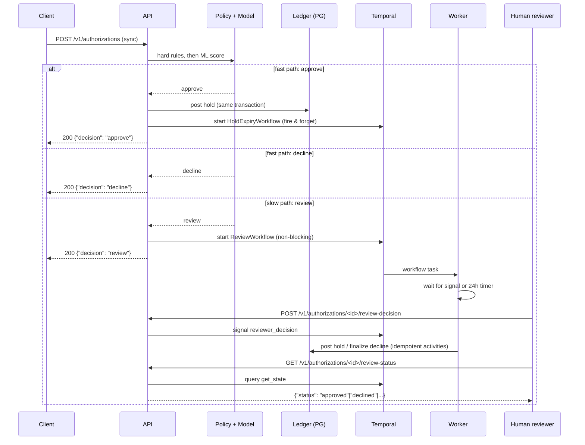

# cardguard

Real-time card authorization risk engine modeled on corporate card spend management.
Flask 3 + SQLAlchemy 2 + PostgreSQL 16, with a double-entry ledger, a deterministic
policy engine, and a LightGBM fraud-scoring model.

## Quickstart

```sh
make up        # postgres 16 + gunicorn API (docker compose)
make migrate   # alembic upgrade head
make seed      # 3 companies, 25 employees, 25 cards, spend policies
make test      # pytest + coverage (needs postgres up)
make data      # generate the synthetic transaction dataset
make train     # train the risk model, write metrics + model card
```

The API serves `POST /v1/authorizations` (idempotent authorization + risk decision),
`POST /v1/authorizations/<id>/capture` and `/reverse`, `GET /v1/accounts/<id>/balance`,
`GET /healthz`, and `GET /readyz`.

## Decisioning pipeline

1. **Policy rules** (`app/risk/policy.py`) — hard rules evaluate first and decline
   immediately without a model call: `MCC_BLOCKED`, `PER_TXN_LIMIT`, `MONTHLY_LIMIT`
   (single SQL aggregate over ledger entries), `VELOCITY` (Postgres range query).
2. **ML scoring** (`app/risk/model.py`) — the model is loaded once at app startup and
   scored in-process. Scores below `threshold_low` approve, scores at or above
   `threshold_high` decline with reason `MODEL_HIGH_RISK`, and scores in between
   `review` (queued for the Temporal workflow in the next step).
3. **Fallback** — if the model artifact is missing or scoring raises, the request is
   decided policy-only, `risk_score` is `null`, and an ERROR is logged. Model failures
   never 500 the authorization request.

### Fast path vs slow path



## Temporal (durable path)

Two workflows run on task queue `cardguard-risk` (`workflows/`):

- **`ReviewWorkflow(authorization_id, timeout_seconds)`** — started fire-and-forget
  whenever the decision is `review`. It waits for the `reviewer_decision(approve,
  reviewer_id, note)` signal; on approve it posts the ledger hold, on decline it
  finalizes the authorization as declined, and if no signal arrives within the timeout
  (24h by default, configurable via `CARDGUARD_REVIEW_TIMEOUT_SECONDS`) it auto-declines
  with `REVIEW_TIMEOUT`. The `get_state` query exposes the current status.
- **`HoldExpiryWorkflow(authorization_id, expires_at)`** — durable timer until the
  hold's expiry; releases the hold and marks the authorization `expired` if it was
  never captured, and exits as a no-op if it was captured or reversed.

Activities (`workflows/activities.py`) are idempotent, keyed by authorization_id, and
run with a retry policy (1s initial interval, 2.0 backoff, max 5 attempts,
`ValidationError` non-retryable). Because Temporal persists workflow state server-side,
killing the worker mid-workflow is safe: a restarted worker resumes exactly where the
crash happened, and replayed activities never double-post (the ledger's unique
constraint backs this up).

### Crash-durability demo

```sh
make demo   # runs scripts/demo_crash_recovery.sh
```

The demo routes an authorization to `review`, kills the worker container mid-workflow
with `docker compose kill worker`, restarts it, sends the approve signal, and shows the
workflow completing with exactly one hold posting in the ledger.

Temporal UI: http://localhost:8080

## Data

The Kaggle credit-card-fraud and IEEE-CIS datasets require authenticated download and
were not fetchable in this environment (the Kaggle API returns 404 unauthenticated), so
the model is trained on synthetic data from `ml/generate_synthetic.py`: ~200k labeled
transactions across 500 cards with a ~0.3% fraud rate. Fraud is generated with genuine
signal — unusual MCC-for-card, amounts 4–15x the card's trailing mean, high velocity
(within minutes of a prior authorization), and odd-hour timestamps — so the features
listed below are learnable rather than noise.

## Training

`ml/train.py` builds features, trains LightGBM (scale_pos_weight for the ~0.3% positive
class), and reports held-out metrics. The train/test split is **time-based, never
random**: rows are ordered by transaction timestamp, the first 80% trains and the last
20% is held out. All features are computed from card history strictly before the
transaction timestamp (no leakage), using the same code path as serving
(`app/risk/features.py`).

The operating threshold is chosen to minimize false declines subject to catching at
least 95% of fraud dollars on the held-out set; `threshold_low` is the highest threshold
still catching 99% of fraud dollars. Artifacts land in `ml/artifacts/` (model_v1.joblib,
metrics.json) and `docs/model-card.md` is rendered from the metrics. See
`docs/query-plans.md` for the policy-aggregate EXPLAIN ANALYZE output.
